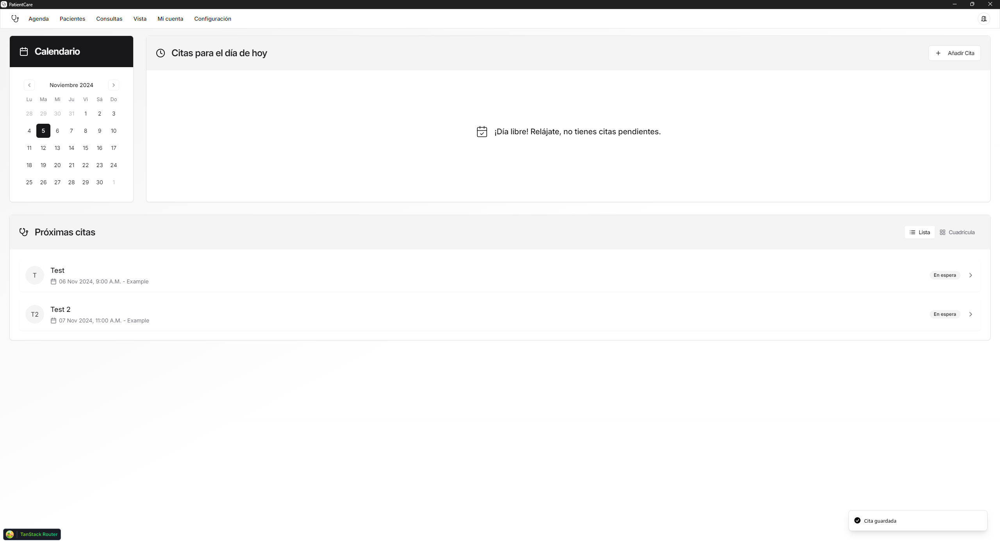

# PatientCare Client



**PatientCare Client** es una aplicación de escritorio construida con Electron, Vite y React que permite a los médicos gestionar sus pacientes, citas y consultas de manera eficiente. La aplicación ofrece una interfaz de usuario intuitiva para interactuar con la API de PatientCare, almacenar imágenes en Cloudinary y realizar solicitudes HTTP con Axios.

## Características

### 1. **Interfaz de Usuario Intuitiva**

- Una interfaz limpia y fácil de usar que permite a los médicos navegar por la aplicación sin complicaciones.

### 2. **Gestión de Pacientes**

- Visualizar, agregar, editar y eliminar pacientes.
- Subir imágenes de perfil utilizando Cloudinary para almacenamiento.

### 3. **Gestión de Citas**

- Programar y gestionar citas de manera sencilla.
- Visualizar el historial de citas y detalles relevantes.

### 4. **Registro de Consultas**

- Registrar notas y observaciones durante las consultas.
- Acceso rápido a la información histórica del paciente.

### 5. **Integración con API**

- Interactuar con la API de PatientCare para realizar operaciones CRUD utilizando Axios.

## Tecnologías Usadas

- **Frontend**: React con Vite
- **Electron**: Para crear aplicaciones de escritorio
- **Gestión de Estado**: React Context API (Redux)
- **HTTP Requests**: Axios
- **Almacenamiento de Imágenes**: Cloudinary

## Cómo Funciona

1. **Configuración Inicial**: La aplicación se conecta a la API de PatientCare para obtener datos de pacientes, citas y consultas.
2. **Gestión de Datos**: Los médicos pueden agregar, editar y eliminar registros desde la interfaz.
3. **Almacenamiento de Imágenes**: Las imágenes se cargan en Cloudinary y se vinculan con los registros de pacientes.

## Cómo Comenzar

1. Clona el repositorio:
   ```bash
   git clone https://github.com/tuusuario/patientcare-client.git
   cd patientcare-client
   ```

## Contact

Para cualquier consulta, no dude en ponerse en contacto conmigo en [alanbusinessnin@gmail.com](alanbusinessnin@gmail.com).
